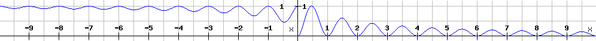

# BladeVibrations
Aim of this project is to one day enable physical simulation of rigid materials such as steel blades.
## Usage
To run this project, please use machine with Windows and .NET 8.0 installed. Download the solution, select 'BladeVibrationControls' as startup project, build and run.

If started properly, 3 windows will appear: console window, rendering window and WinForms with controls.

### Console
The program was designed so that user can freely switch between individual modes at any given time, although at the moment this feature is not consistent and occasional restart might be required.

All available commands are printed out at the start. Here is their explanation:
- **exit/stop/quit** - Requests freeing up all resources and exiting the application
- **gpu** - Start graphics window
- **loadmodel &lt;filename&gt;** - Load model (preferably .fbx) that is located at 'Assets/Models' folder
- **voxelize** - Generate 3d voxel representation of loaded model
- **savevoxel &lt;filename&gt;** - Attempts to save the generated 3d representation into a gif
- **mode &lt;mode&gt;** - Switch to selected visual mode
Other commands are either not implemented or no longer maintained.

### Graphics window
During any 3d mode, camera controls are: Left Mouse Button - Look around, Right Mouse Button - Move camera, Mouse Wheel - Move closer/further.

Available modes are:
- **Solid**: Render loaded model mesh, color representing position in world space. Includes skybox and point matrix (-3|3)³ points every 0.3. This mode is mostly for debugging to show everything is loaded and can be displayed correctly.
- **Voxel**: Show slice through the voxelized representation in space. Slicing plane can be moved by IKJLUO (very slow) and rotated by TGFHRY.
- **Sim**: Displays difference between voxel 'physical' representation and the fragment position in world space. Each axis difference is visualized as a following function of the offset:
    
    This is used to visually separate positive/negative values and cleary display both small and large values on (0;1) color range.

### Conrol window
Control window will follow the render window during a 'sync' mode. This is to visualize some important values of individual valid modes. After clicking the 'Pause Sync', during the 'paused' mode, these values can be modified and applied by clicking the 'Aplly' button. Warning, this can be applied across multiple/all modes like reseting camera position.
